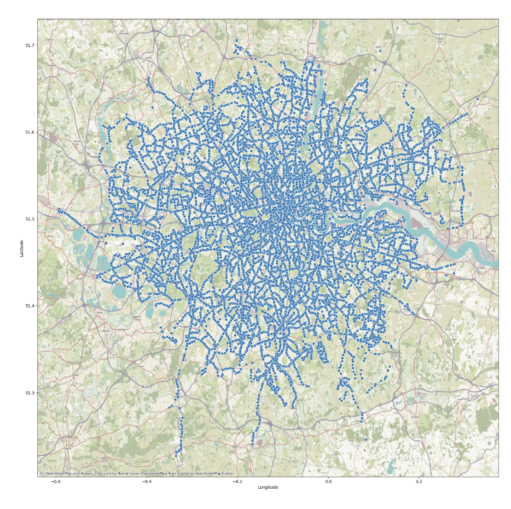
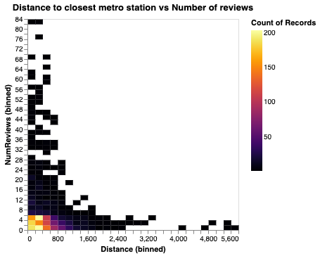
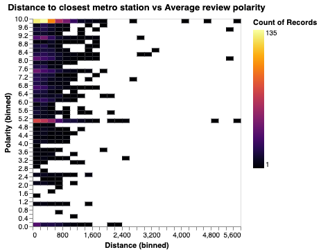
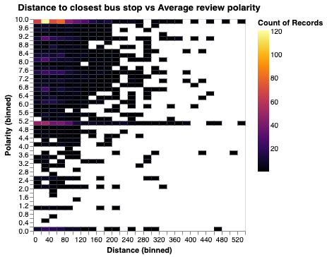
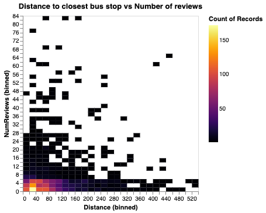

# CDC 2024

Caleb Han and Mason Mines

[Devpost](https://devpost.com/software/public-transportation-on-london-restaurant-reviews)

[Presentation](https://docs.google.com/presentation/d/1kyd4Mu57O2WiDp4WXCl7dfsmKFFIsag4-vKr7cl2rtA/edit?usp=sharing)

## Datasets used

[Popular culture track - TourPedia API](http://tour-pedia.org/api/)

[London Metro Stations](https://www.doogal.co.uk/london_stations.php)

[London Bus Stops](https://data.london.gov.uk/dataset/tfl-bus-stop-locations-and-routes)

## Project Description

Our project involves analyzing the possible correlation between the number of reviews and polarity of restaurants in London
in comparison to its proximity to a public bus stop or a metro station.

## Data

We used the TourPedia API to retrieve all restaurant data available in London. We then averaged the polarity for each restaurant.
The polarity is a measure of how positive or negative the reviews are for a restaurant. A 10 is the best review while a 0 is the worst. We also counted the number of reviews for each restaurant.

### Polarity

### Number of reviews

We then found the closest bus stop and metro station to each restaurant using the London Bus Stops and London Metro Stations datasets.

### Metro

### Bus

## Results

We found that restaurants closer to a bus stop or metro station tend to have a higher number of reviews and a higher polarity.

### Metro

### Bus

